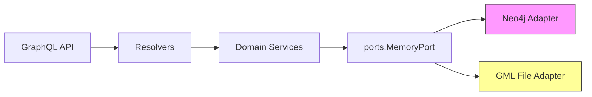

# Memory graph system

The memory system stores knowledge as a graph of `nodes` and `edges`. It is exposed via GraphQL and decoupled through the `MemoryPort` interface.

## Topology and supported backends

- Neo4j backend: production-ready, supports transactions, indexes and Cypher queries.
- File/GML backend: local testing implementation (single-writer, persistence via asynchronous snapshot).

## Component diagram

## Main operations

- `addMemory` / `addMemoryNode`: add nodes/facts with deduplication.
- `addRelation`: create edges between nodes.
- `searchMemory` / `userGraph`: queries and extract user-specific subgraphs.

## Consistency and scalability

- Neo4j: recommended for multi-instance deployments and concurrent workloads.
- GML: only for local development; not recommended in production without distributed locking.
- Cache/digest: `MemoryDigestService` generates summaries with TTL; implement `MemoryDigestCache` (e.g., Redis) for cluster-wide coherence.

## Risks and best practices

- Add indexes in Neo4j for `:Fact(label)` and `:User(id)`.  
- Persist embeddings in a vector DB if you need large-scale semantic search.

References: [schema/memory.graphql](schema/memory.graphql), [apps/backend/internal/infrastructure/adapters/memory/neo4j/adapter.go](apps/backend/internal/infrastructure/adapters/memory/neo4j/adapter.go), [apps/backend/internal/infrastructure/adapters/memory/file/gml_backend.go](apps/backend/internal/infrastructure/adapters/memory/file/gml_backend.go)
