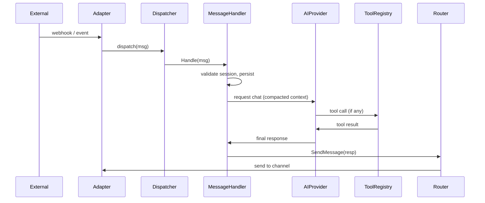

# Message processing

Summary: All inbound messages converge into a unified pipeline that validates, persists, enriches context, executes the agentic loop (LLM + tools), and routes the response to the appropriate channel adapter.

## Sequence diagram

## Key components

- `Dispatcher` / `MessageDispatcher`: normalizes inputs (GraphQL, webhooks, adapters, scheduler) and calls `MessageHandler.Handle`.
- `MessageHandler`: pairing/session validation, persistence (`messageRepo.Save`), `contextInjector`, `compactionSvc`, `runAgenticLoop`.
- `AIProvider` (port): adapters live under `internal/infrastructure/adapters/ai/*`.
- `mcp.ToolRegistry`: registers and executes tools invoked by the LLM.
- `messagingRouter` / `chanRegistry`: route outputs using `msg.Metadata["channel_type"]` to concrete adapters (Telegram, WhatsApp, Twilio, Discord, loopback).
- `EventBus` / `subscriptions`: notifies UI and subscribers.

## Operational notes and recommendations

- Monitor latencies in `MessageHandler.Handle` (end-to-end tracing). Measure `AIProvider.Chat` calls (token usage and time).  
- Document required `msg.Metadata` fields used for routing (e.g. `channel_type`, `channel_id`).
- Use `LoopbackDispatcher` to re-inject scheduled prompts or internal tasks.

Code references: [apps/backend/internal/domain/handlers/message_handler.go](apps/backend/internal/domain/handlers/message_handler.go), [apps/backend/cmd/openlobster/main.go](apps/backend/cmd/openlobster/main.go), [schema/conversations.graphql](schema/conversations.graphql)
