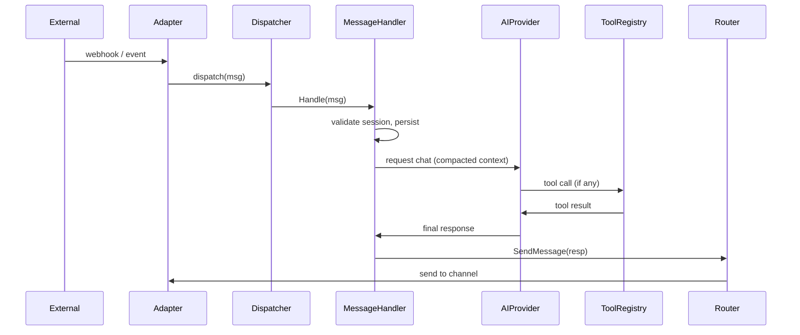

# Message processing

## What happens when someone sends a message

When a user sends a message through Telegram, Discord, or any connected channel, it goes through a predictable journey. Understanding this pipeline helps you troubleshoot why something might not work and explains why certain features exist.

This is the end-to-end flow:

### The 11-step pipeline (in plain language)

1. **Message arrives** — Your channel adapter (Telegram bot, Discord bot, etc.) receives the message from the platform and converts it into a standard format that OpenLobster understands.

2. **Dispatcher routes it** — The dispatcher examines where the message came from (Telegram? Discord? GraphQL? Scheduled task?) and sends it to the main message handler.

3. **Pairing validation** — OpenLobster checks: "Do I know who this user is?" If they're messaging for the first time, they'll go through the pairing flow. If they're already paired, we continue.

4. **Load context** — The agent gathers context: previous conversations with this user, facts from the memory graph (things the agent has learned about them), and the system prompt that defines how the agent should behave.

5. **Find tools** — The agent looks up which tools are available right now. This includes built-in tools (browser, filesystem, terminal) plus any external MCP servers you've connected.

6. **Check permissions** — Before the AI model even sees the tools, the permission manager filters them. If you've set a tool to "deny" for this user, they won't see it offered, even if it's available. If you've set "ask", the agent will ask for approval before using it.

7. **Send to AI provider** — OpenLobster packages up: the user's message, the conversation history, available tools, the system prompt, and any memory facts. It sends all of this to your configured AI provider (OpenAI, Anthropic, Ollama, etc.).

8. **Model decides** — The AI model reads everything and decides: "Should I answer directly, or do I need to use a tool?" If it needs a tool, it tells OpenLobster which one and what arguments to use.

9. **Execute tools** — If the model asked for a tool, OpenLobster runs it. This might mean fetching a webpage, running a terminal command, searching the memory graph, or calling an external API through an MCP server. The result comes back.

10. **Get final response** — OpenLobster sends the tool results back to the AI model so it can generate its final answer.

11. **Save and deliver** — The response is saved to the database, the memory graph is updated with any new facts, and the message is routed back to the channel where it came from (Telegram, Discord, etc.). At the same time, the dashboard is notified in real time so you see the conversation update live.

### What you see in the Chat view

In the Chat UI, you see:

- **USER** labels for messages from people
- **OPENLOBSTER** labels for the agent's responses
- **TOOL** labels showing which tools the agent used and what they returned

The **TOOL** messages are just for your visibility. Users on Telegram or Discord won't see them — they only see the final response.

### What could slow this down

Each step adds latency. In a typical message:

- Steps 1-6 are fast (milliseconds)
- Step 7-8 (sending to AI provider) depends on which provider — OpenAI might take 2-5 seconds, Ollama on your local machine might take 1-2 seconds
- Step 9 (tool execution) varies: a filesystem read is instant, but a web search might take several seconds
- Step 10 is fast again
- Step 11 is just database writes

If a response is taking a long time, it's almost always happening in step 8 or 9.

### What to watch in the logs

When you look at **Recent Logs** in the dashboard, here's what you might see:

| Log Level | Typical Source | What It Means |
|-----------|----------------|--------------|
| INFO | Adapter (step 1) | Message received on a channel |
| INFO | MessageHandler (step 3) | User pairing validated |
| INFO | ToolRegistry (step 9) | A tool was executed |
| WARN | AIProvider (step 7) | Rate limit approaching, slow response from model |
| WARN | ToolRegistry (step 9) | Tool call failed or timed out, agent will retry or report error |
| ERROR | Adapter (step 1) | Channel offline or authentication failed |
| ERROR | AIProvider (step 7) | Model provider unavailable or API error |

If you see an ERROR from a specific step, you know which part of the pipeline to investigate.

---

## Technical diagram

For reference, here's the sequence diagram showing how components talk to each other:

---

## Why this architecture matters

This design has some important consequences:

**Tool execution is part of the same flow** — When the agent uses a tool, it's not a separate process. The whole thing waits for the tool to finish before generating the response. This means tools can be trusted (they're in-process) but also that a slow tool slows down the whole response.

**Permissions are enforced late** — Tools are filtered in step 6, not earlier. This is intentional: it means the AI model still "knows" about tools (for its reasoning), but isn't offered ones you've denied. It makes the agent smarter without violating user permissions.

**Memory is automatic** — Step 11 always updates the memory graph. The agent doesn't need to explicitly ask to save things; they just get saved. This is why you can search old conversations in the Memory view — it's automatic extraction.

**Every message follows the same path** — Whether it comes from Telegram, Discord, a GraphQL mutation, or a scheduled task, it goes through the same 11 steps. This consistency means the agent behaves predictably across channels.
