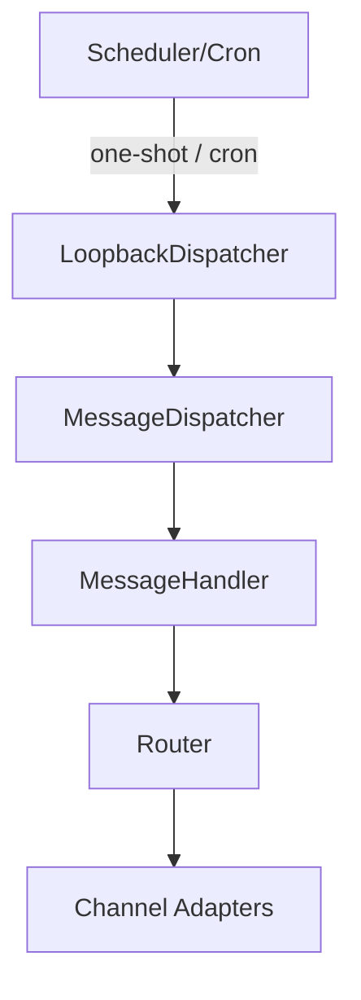

# Routing and scheduling

## Advanced routing

- `chanRegistry` registers adapters that implement `MessagingPort` (Start, HandleWebhook, SendMessage, SendMedia).
- `messagingRouter` routes responses based on `msg.Metadata["channel_type"]` and `channel_id`.
- Implemented adapters: Telegram, WhatsApp, Twilio, Discord, Loopback.

### Routing patterns

- Adapter pattern: decouple channels using the `MessagingPort` interface.
- Metadata-based routing: `MessageHandler` attaches metadata used by the router when composing responses.
- Hot-reload: `chanRegistry` supports enabling/disabling adapters at runtime.

## Scheduler and tasks

- Supported formats: `cron` expressions for recurring jobs and ISO 8601 datetimes (UTC) for one-shot tasks.
- Implementation: scheduled jobs are enqueued or converted into loopback messages via `LoopbackDispatcher` → processed by `MessageHandler`.

### High-level diagram

### Retries and backoff

- Adapters and `MessageHandler` include simple retry and logging; for robust queuing use an external broker (RabbitMQ/Redis) and a dead-letter mechanism.

## Recommendations

- Document cron vs ISO examples (see [docs/tasks/scheduling.md](../tasks/scheduling.md)).
- In production, prefer an external scheduler for high reliability (Kubernetes CronJob or a worker queue).  
- Log and audit scheduled tasks and their origin (user vs system).

References: [apps/backend/internal/domain/handlers/loopback_dispatcher.go](apps/backend/internal/domain/handlers/loopback_dispatcher.go), [docs/tasks/scheduling.md](../tasks/scheduling.md)
